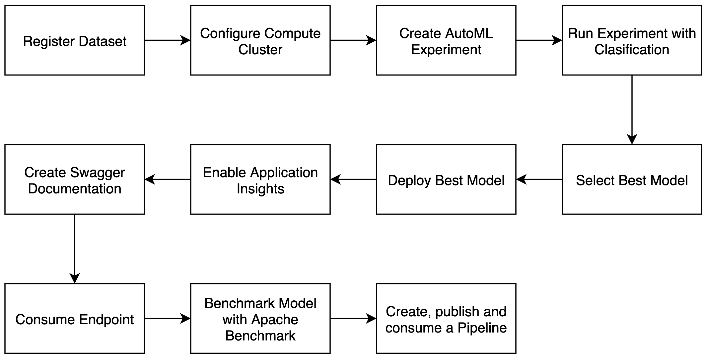
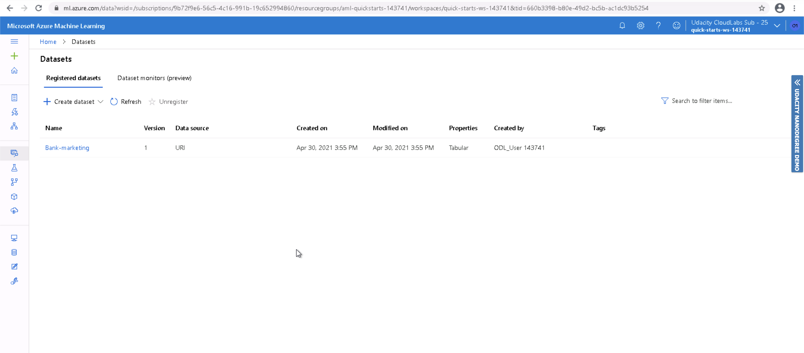

# Operationalizing Machine Learning

## Table of contents
* [Overview](#Overview)
* [Dataset](#Dataset)
* [Architectural Diagram](#Architectural-Diagram)
* [Key steps](#Key-Steps)
* [Screen Recording](#Screen-Recording)
* [Future Work](#Future-Work)
* [References](#References)

## Overview
This project is part of the Udacity's Machine Learning Engineer with Microsoft Azure nanodegree, this is the second project where I create, publish and consume a Pipeline. I also deploy the pipeline as a http rest endpoint, create Swagger documentation, benchmarking with Apache.

## Dataset

The data used in this project is the same Banking Marketing Dataset used in the previous project. It belongs to a portuguese banking institution and it is related to marketing campaigns. this dataset has the following fields:
Input variables:

**bank client data**

1 - age (numeric)

2 - job : type of job (categorical: 'admin.','blue-collar','entrepreneur','housemaid','management','retired','self-employed','services','student','technician','unemployed','unknown')

3 - marital : marital status (categorical: 'divorced','married','single','unknown'; note: 'divorced' means divorced or widowed)

4 - education (categorical: 'basic.4y','basic.6y','basic.9y','high.school','illiterate','professional.course','university.degree','unknown')

5 - default: has credit in default? (categorical: 'no','yes','unknown')

6 - housing: has housing loan? (categorical: 'no','yes','unknown')

7 - loan: has personal loan? (categorical: 'no','yes','unknown')

**related with the last contact of the current campaign**

8 - contact: contact communication type (categorical: 'cellular','telephone')

9 - month: last contact month of year (categorical: 'jan', 'feb', 'mar', ..., 'nov', 'dec')

10 - day_of_week: last contact day of the week (categorical: 'mon','tue','wed','thu','fri')

11 - duration: last contact duration, in seconds (numeric). Important note: this attribute highly affects the output target (e.g., if duration=0 then y='no'). Yet, the duration is not known before a call is performed. Also, after the end of the call y is obviously known. Thus, this input should only be included for benchmark purposes and should be discarded if the intention is to have a realistic predictive model.

**other attributes**

12 - campaign: number of contacts performed during this campaign and for this client (numeric, includes last contact)

13 - pdays: number of days that passed by after the client was last contacted from a previous campaign (numeric; 999 means client was not previously contacted)

14 - previous: number of contacts performed before this campaign and for this client (numeric)

15 - poutcome: outcome of the previous marketing campaign (categorical: 'failure','nonexistent','success')

**social and economic context attributes**

16 - emp.var.rate: employment variation rate - quarterly indicator (numeric)

17 - cons.price.idx: consumer price index - monthly indicator (numeric)

18 - cons.conf.idx: consumer confidence index - monthly indicator (numeric)

19 - euribor3m: euribor 3 month rate - daily indicator (numeric)

20 - nr.employed: number of employees - quarterly indicator (numeric)

Output variable (desired target):

21 - y - has the client subscribed a term deposit? (binary: 'yes','no')

## Architectural Diagram
The diagram below shows a rough overview of the project and the steps it followed.

## Key Steps
**Register Dataset**
The first step is to check if the Bank Marketing dataset is uploaded to Azure ML Studio, once it is uploaded we can continue.

**Configure Compute Cluster**
The next step is to create a compute cluster with the following configuration:
- Standard_DS12_v2 for virtual machine size.
- 1 for minimum number of nodes

**Create AutoML Experiment**

**Run Experiment with Clasification**

**Select Best Model**

**Deploy Best Model**

**Enable Application Insights**

**Create Swagger Documentation**

**Consume Endpoint**

**Benchmark Model with Apache Benchmark**

**Create, publish and consume a Pipeline**

## Screen Recording
*TODO* Provide a link to a screen recording of the project in action. Remember that the screencast should demonstrate:

## Future work
*TODO (Optional):* This is where you can provide information about any standout suggestions that you have attempted.

## References
- [Bank marketing dataset](http://archive.ics.uci.edu/ml/datasets/Bank+Marketing)
- [Udacity project starter files](https://github.com/udacity/nd00333_AZMLND_C2)
