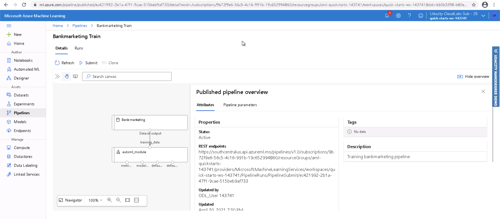

# Operationalizing Machine Learning

## Table of contents
* [Overview](#Overview)
* [Dataset](#Dataset)
* [Architectural Diagram](#Architectural-Diagram)
* [Key steps](#Key-Steps)
* [Screen Recording](#Screen-Recording)
* [Future Work](#Future-Work)
* [References](#References)

## Overview
This project is part of the Udacity's Machine Learning Engineer with Microsoft Azure nanodegree, this is the second project where I create, publish and consume a Pipeline. I also deploy the pipeline as a http rest endpoint, create Swagger documentation, benchmarking with Apache.

## Dataset

The data used in this project is the same Banking Marketing Dataset used in the previous project. It belongs to a portuguese banking institution and it is related to marketing campaigns. this dataset has the following fields:
Input variables:

**bank client data**

1 - age (numeric)

2 - job : type of job (categorical: 'admin.','blue-collar','entrepreneur','housemaid','management','retired','self-employed','services','student','technician','unemployed','unknown')

3 - marital : marital status (categorical: 'divorced','married','single','unknown'; note: 'divorced' means divorced or widowed)

4 - education (categorical: 'basic.4y','basic.6y','basic.9y','high.school','illiterate','professional.course','university.degree','unknown')

5 - default: has credit in default? (categorical: 'no','yes','unknown')

6 - housing: has housing loan? (categorical: 'no','yes','unknown')

7 - loan: has personal loan? (categorical: 'no','yes','unknown')

**related with the last contact of the current campaign**

8 - contact: contact communication type (categorical: 'cellular','telephone')

9 - month: last contact month of year (categorical: 'jan', 'feb', 'mar', ..., 'nov', 'dec')

10 - day_of_week: last contact day of the week (categorical: 'mon','tue','wed','thu','fri')

11 - duration: last contact duration, in seconds (numeric). Important note: this attribute highly affects the output target (e.g., if duration=0 then y='no'). Yet, the duration is not known before a call is performed. Also, after the end of the call y is obviously known. Thus, this input should only be included for benchmark purposes and should be discarded if the intention is to have a realistic predictive model.

**other attributes**

12 - campaign: number of contacts performed during this campaign and for this client (numeric, includes last contact)

13 - pdays: number of days that passed by after the client was last contacted from a previous campaign (numeric; 999 means client was not previously contacted)

14 - previous: number of contacts performed before this campaign and for this client (numeric)

15 - poutcome: outcome of the previous marketing campaign (categorical: 'failure','nonexistent','success')

**social and economic context attributes**

16 - emp.var.rate: employment variation rate - quarterly indicator (numeric)

17 - cons.price.idx: consumer price index - monthly indicator (numeric)

18 - cons.conf.idx: consumer confidence index - monthly indicator (numeric)

19 - euribor3m: euribor 3 month rate - daily indicator (numeric)

20 - nr.employed: number of employees - quarterly indicator (numeric)

Output variable (desired target):

21 - y - has the client subscribed a term deposit? (binary: 'yes','no')

## Architectural Diagram
The diagram below shows a rough overview of the project and the steps it followed.


## Key Steps
**Register Dataset**

The first step is to check if the Bank Marketing dataset is uploaded to Azure ML Studio, once it is uploaded we can continue.


**Configure Compute Cluster**

The next step is to create a compute cluster with the following configuration:
- Standard_DS12_v2 for virtual machine size.
- 1 for minimum number of nodes

This cluster is named "compute-standard"

**Create AutoML Experiment**

Now we have to create an AutoML experiment with the Bank Marketing dataset and the following configuration:
- Classification.
- Explain best model.
- Exit criterion: 1 hour.
- Concurrency: 5.

**Run Experiment with Clasification**

Here the experiment is completed


**Select Best Model**

The experiment took about 32 minutes to complete, here we can see that the Voting Ensemble model is the most accurate with an accuracy of 91.866%


**Deploy Best Model**

Now that we have selected the best model, we can deploy it as an endpoint.


Then, it is deployed, but Application Insights is not configured, so we will do that in the next step.


**Enable Application Insights**

To enable Application Insights we have to run the logs.py file provided in the project with the name of the endpoint that we are going to enable the App Insights, and we have to get the config.json file from Azure Machine Learning Studio.

When we run the logs.py file we can get important logs, which are available at runtime or in Azure Machine Learning Studio, this screenshot is from the Deployment Logs tab in Azure, which has the same data as the python logs obtained when the file is run.


We now have App Insights enabled in our endpoint.


The next step is to create the Swagger documentation, we are going to download the Swagger .json file from the SWAGGER URI located in the endpoint details.

**Create Swagger Documentation**

o start the swagger server we are going to need to download the swagger.json file, then we need to run the serve.py file to expose the swagger.json file to be picked up by swagger.

Now we have to edit the port in the swagger.sh file, in specific this part
```Shell
docker run -p 80:8080 swaggerapi/swagger-ui
```
We have to change the port from 80 to another port, preferably above 9000, in my case I used 9001. Once that change is done, we run the swagger.sh file.


Once we enter to the swagger site in localhost:9001, we have to input the swagger.json file location, which is in http://localhost:8000/swagger.json, once we hit "explore", we can see the following data.


We can see the required parameters for the endpoint calling


We can see the posible responses from the endpoint


Once this is done we can consume the endpoint

**Consume Endpoint**

To consume the endpoint we have to run the endpoint.py file, and input our endpoint URL and the auth key, once we do that and we run the file we will see a json response from the endpoint.


The "result" key indicates a successful endpoint consuming. Now we can benchmark the endpoint to get some useful metrics.

**Benchmark Model with Apache Benchmark**

To benchmark the endpoint we have to run the benchmark.sh file, we have to add the authentication key and the endpoint url. Once we do that and we run the file, we will get some useful metrics of the performance of our endpoint.


**Create, publish and consume a Pipeline**

In the final part of the project we create a Pipeline for this entire process. For this we use the Jupyter Notebook named aml-pipelines-with-automated-machine-learning-step.ipynb, and we have to change the following fields in our code to use the same resources as we did in the previous steps:

```Python
experiment_name = 'automl-experiment'
amlcompute_cluster_name = "compute-standard"
key = "Bank-marketing"
```

In this screenshot we have 2 pipeline runs, the one that says "Run 102" is an AutoML Model that took about 34 minutes to run. The second one that says "Run 1" is an experiment with a pipeline endpoint that uses the model that we just mentioned.


In this screenshot we can see the Step Runs widget to get relevant data about our current run.


Here we can see the complete pipeline run of the "Run 102".


Here we can see the pipeline endpoint, and that it appears as "Active" on the Status column.


Now, we can see an overview of the pipeline, and we can see how it gets data from the Bank Marketing dataset and uses it in the AutoML Module.


Finally, we can see in this screenshot all the experiments as completed.


## Screen Recording
Link to the screen recording of the project in action:
https://youtu.be/vJ0Rv67EAGk

## Future work
- The data had a class imbalance issue as shown in this screenshot:


- For a better accuracy in the future the data should be balanced before model training

- Also, because the virtual environment did not allow us to do the step of  'Enable security and authentication', it was not practiced, for a future work or for a real life project this must be done.

- Even though accuracy was not an objective in this project, the accuracy of the model created can be made better with more training time.

## References
- [Bank marketing dataset](http://archive.ics.uci.edu/ml/datasets/Bank+Marketing)
- [Udacity project starter files](https://github.com/udacity/nd00333_AZMLND_C2)
